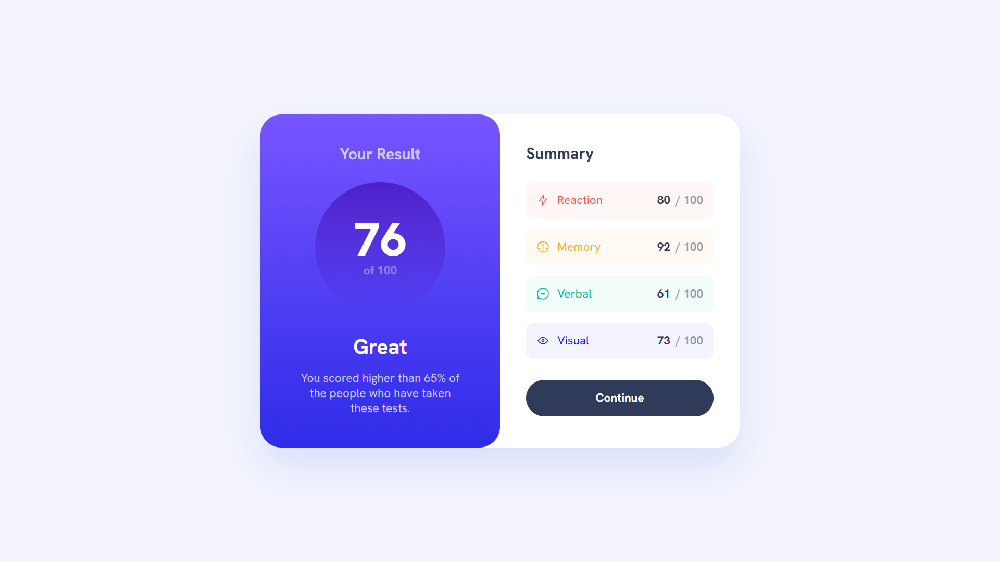

# Frontend Mentor - Results summary component solution

This is a solution to the [Results summary component challenge on Frontend Mentor](https://www.frontendmentor.io/challenges/results-summary-component-CE_K6s0maV).

## Table of contents

- [Overview](#overview)
  - [The challenge](#the-challenge)
  - [Screenshot](#screenshot)
  - [Links](#links)
- [My process](#my-process)
  - [Built with](#built-with)
  - [What I learned](#what-i-learned)
  - [Useful resources](#useful-resources)
- [Author](#author)

## Overview

### The challenge

Users should be able to:

- View the optimal layout for the interface depending on their device's screen size
- See hover and focus states for all interactive elements on the page
- **Bonus**: Use the local JSON data to dynamically populate the content

### Screenshot

### Links

- Solution URL: [GitHub](https://github.com/g-akca/results-summary-component)
- Live Site URL: [Results Summary Component](https://g-akca.github.io/results-summary-component/)

## My process

### Built with

- Semantic HTML5 markup
- CSS custom properties
- Flexbox
- CSS Grid
- Mobile-first workflow
- Media queries
- Dynamic JavaScript
- [React](https://reactjs.org/) - JS library

### What I learned

This was my first time building a React project from the scratch by myself, so I'm proud of how I performed and this has been a valuable experience.

### Useful resources

- [Deploying a Static Site | Vite](https://vite.dev/guide/static-deploy.html#deploying-a-static-site) - I was able to deploy my app to GitHub Pages thanks to this tutorial by Vite.

## Author

- GitHub - [@g-akca](https://github.com/g-akca)
- Frontend Mentor - [@g-akca](https://www.frontendmentor.io/profile/g-akca)